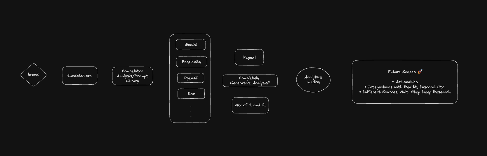

# TDS - AI Search Visibility Analytics

Track how visible your brand is across AI search engines (ChatGPT, Gemini, Perplexity, Exa).

# A Demo of the project can be found here: [click here!](https://youtu.be/UWQqr3DtERU)

## System Architecture


## Prerequisites

- Python 3.12+
- Node.js 18+ (npm or bun)
- Supabase project with migrations applied

## Quick Start

```bash
# 1. Clone and enter the repo
git clone <repo-url> && cd tds

# 2. Set up backend env
cp backend/.env.example backend/.env
# Edit backend/.env with your API keys

# 3. Run the database migrations in Supabase SQL Editor:
#    - supabase/migrations/001_initial_schema.sql
#    - supabase/migrations/002_brand_mentions.sql
#    - supabase/migrations/003_brand_mention_citations.sql
#    - supabase/migrations/004_analysis_progress.sql

# 4. Start everything
bash start.sh
```

The app will be available at `http://localhost:3000` (frontend) and `http://localhost:8000` (backend API).

## Commands

### One-command startup (recommended for VMs / CI)

```bash
bash start.sh          # Install deps, build, start both services
bash start.sh --dev    # Same but with hot reload (no build step)
```

### Makefile targets

```bash
make install    # Install backend + frontend dependencies
make start      # Build frontend, then start both services (production)
make dev        # Start both services with hot reload
make stop       # Kill both services (free ports 8000 & 3000)
make clean      # Same as stop
make logs       # Tail recent logs from both services
make health     # Check if both services are responding
```

### Manual startup

```bash
# Backend
cd backend
pip install -e .
python -m uvicorn app.main:app --host 0.0.0.0 --port 8000

# Frontend (separate terminal)
cd frontend
npm install && npm run build
NEXT_PUBLIC_API_URL=http://localhost:8000 npx next start --port 3000 -H 0.0.0.0
```

## Environment Variables

### Backend (`backend/.env`)

| Variable | Required | Description |
|----------|----------|-------------|
| `OPENROUTER_API_KEY` | Yes | OpenRouter API key for LLM access |
| `EXA_API_KEY` | Yes | Exa AI API key for search + discovery |
| `SUPABASE_URL` | Yes | Supabase project URL |
| `SUPABASE_KEY` | Yes | Supabase secret (service role) key |
| `CORS_ORIGINS` | No | Comma-separated allowed origins (default: `http://localhost:3000`) |

### Frontend

| Variable | Required | Description |
|----------|----------|-------------|
| `NEXT_PUBLIC_API_URL` | No | Backend API URL (default: `http://localhost:8000`) |

## Custom Ports

```bash
BACKEND_PORT=9000 FRONTEND_PORT=4000 bash start.sh
```

Or with Make:

```bash
make start BACKEND_PORT=9000 FRONTEND_PORT=4000
```

## Project Structure

```
tds/
├── backend/          # FastAPI backend
│   ├── app/
│   │   ├── api/      # Route handlers
│   │   ├── models/   # Pydantic schemas
│   │   └── services/ # Business logic (engines, scoring, etc.)
│   ├── .env          # API keys (not committed)
│   └── pyproject.toml
├── frontend/         # Next.js frontend
│   └── src/
│       ├── app/      # Pages
│       ├── components/
│       └── lib/      # API client, types
├── supabase/
│   └── migrations/   # SQL migrations (run in order)
├── Makefile
├── start.sh          # One-command startup
└── README.md
```
